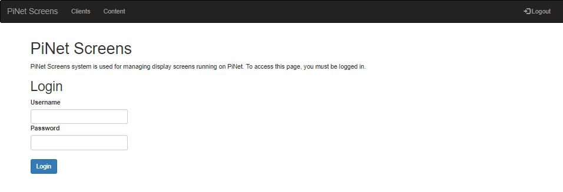
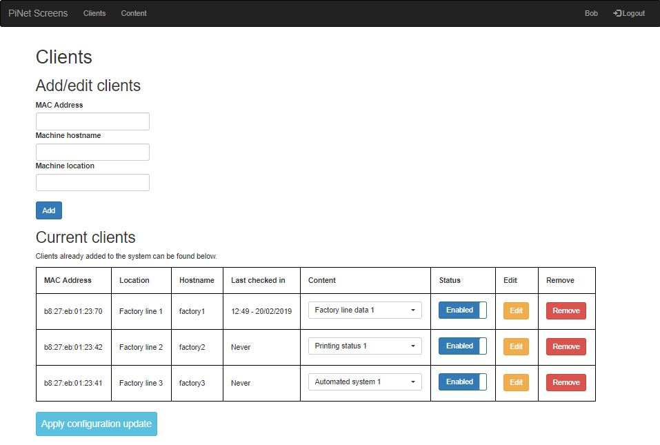
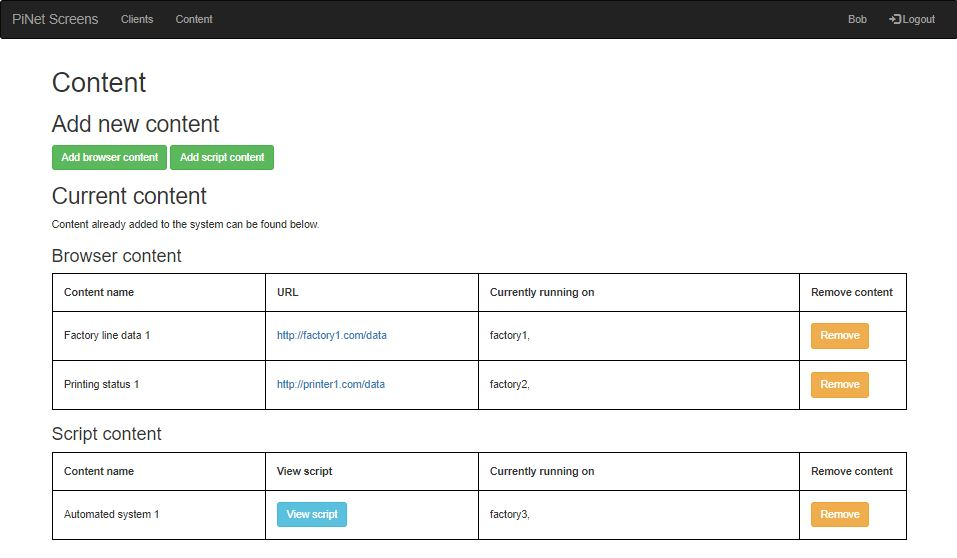

# PiNet Screens
PiNet Screens is a web based management tool for configuring PiNet to be used with multiple display screens across an organisation.   

The features of the system include:
- Web based, built using Python 3 and Flask.
- Secure login system to avoid unauthorised changes to content.
- Content management system, allowing for built in support of web content being displayed or custom scripts.
- Automatic (or manual) addition of new Raspberry Pis to the system when they are first started up.
- Easy to assign content to a Raspberry Pi, with a simple drop down menu.
- Automatic applying of new content updates.   


## Installation
Before PiNet Screens can be installed, make sure PiNet is installed. PiNet Screens must be installed on the same operating system that PiNet itself is installed on.   
PiNet Screens supports PiNet Stretch and above. PiNet Jessie/Wheezy are not formally supported.   

- Log onto the PiNet server and run the following command ```wget https://links.pinet.org.uk/install-screens```
- To start the installation, run ```sudo bash install-screens```
- When prompted, enter `y` followed by hitting enter.
- When prompted, enter a username and password to use for the system.
- Once the installation is completed, a web browser will open. You can access the system using ```http://localhost``` on the PiNet server, or by entering the servers IP address in a web browser on the local network.   


## Usage   
The PiNet Screens system is split into 3 main sections. Login, Clients and Content. Once logged in, you are presented with the clients page. From the clients page you can assign content to individual Raspberry Pis. On the contents page, you can create this content that is assigned to individual clients.   
### Login   
The first step in using PiNet Screens is logging in. Navigate to ```http://localhost``` on the PiNet server, then enter your credentials you created on setup.   
   

### Clients   
From the clients page, you can create new clients, edit clients, disable clients or edit the content displayed on them.   

   
Usually clients are automatically added when they first start up, but if you need to manually add a client, you can do so from the 3 boxes at the top of the page. Also, if you click the edit button on any pre-existing client, these boxes will populate to allow for editing.   
Once added, content can be assigned from the dropdown box of content. When new content is applied, the Raspberry Pi will generally notice within 60s and update its display.

If for any reason a client needs to have PiNet Screens disabled on it for maintenance for example, clicking on the status switch will disable PiNet Screens.   

### Content   
To have anything display on the Raspberry Pis, content items must be created. There are 2 types available.   
1. Browser content - This is a URL that will be displayed full screen using Chromium in "kiosk mode".   
2. Custom scripts - This allows for custom scripts to be built and run.   

    

Once content has been added, you can see a list of clients it is currently running on, along with removing the content if needs be.   

## Debugging / Issues
### PiNet Screens isn't accessible when navigating to its URL.
- Try restarting the web server, this can be done with ```sudo service pinetscreens restart```.   
- If that doesn't solve the issue, try seeing if the service is running ```sudo service pinetscreens status```.   
- If all else fails, you can try rerunning the installation script by following the install instructions above again. PiNet Screens supports its install script being run multiple times.   

### PiNet Screens web page throws an error on hitting the "Apply configuration" button
This usually means the permissions to the files/folders edited by the apply are incorrect. The quickest way to resolve this is rerunning the PiNet Screens install script, which will correct any permissions.   
The permissions required include:   
- Read/write permission to the `/home/shared/screens` folder.   
- (Group level only to pinetscreen) read/write permission to `/opt/ltsp/armhf/etc/lts.conf` file.
